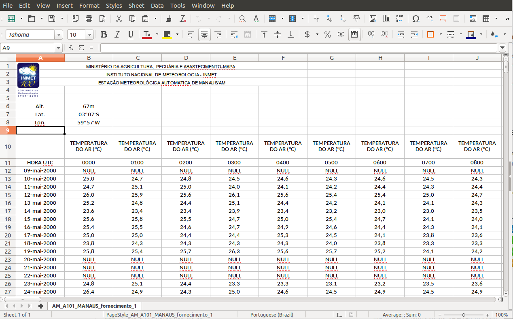

```{r setup, include = FALSE}
knitr::opts_chunk$set(
  collapse = TRUE,
  comment = "#>"
)
#source("../R/str_distinct.R")
```


## Introdução

Os dados horários de Estações Meteorológicas Automáticas ([EMA](http://www.inmet.gov.br/portal/index.php?r=estacoes/estacoesAutomaticas)) solicitados no [site do INMET](http://www.inmet.gov.br/portal/index.php?r=home/contato) são enviados em um DVD com arquivos em formato [Microsoft Excel](https://en.wikipedia.org/wiki/Microsoft_Excel). Nesta vinheta mostra-se como são organizados os arquivos no DVD para posteriormente processá-los adequadamente.


## Estrutura de diretórios

Os arquivos Excel das EMAs do INMET são fornecidos em uma estrutura de diretórios organizada por região do Brasil e período.

```{r chun5}
data_dir <- "dvd_xls_files"
# diretorios das regioes, 
path_regions <- dir(data_dir, full.names = TRUE)
path_regions
```


Os diretórios nomeados `NOMEREGIAO` tem dados prévios à 2015, aqueles nomeados `NOMEREGIAO_2017` tem dados de 2015 a março de 2017.

No diretório de cada região há sub-diretórios dos estados da região. Por exemplo, para região NORTE temos os seguintes sub-diretórios:

```{r chun6}
path_norte <- dir(file.path(data_dir, "NORTE"), full.names = TRUE)
path_norte
```

No sub-diretório de um estado estão os arquivos de dados das EMAs localizadas no estado. Abaixo são mostrados os arquivos do estado do AC.

```{r chun7}
(path_state <- path_norte[1])
list.files(path_state, full.names = TRUE)
```

## Arquivos de dados de uma  EMA

Na lista acima há dois arquivos com nomes semelhantes para uma mesma EMA. **Os arquivos referem-se a diferentes variáveis meteorológicas e serão chamados por convenção como**:

- **arquivo 1**: arquivo da EMA com dados de temperatura e umidade do ar;

- **arquivo 2**: arquivo da EMA com dados de outras variáveis meteorológicas: pressão atmosférica, vento, radiação e precipitação; 

A única diferença **aparente** do arquivo 2 para o 1 é que seu nome apresenta um \"_\" precedendo a extensão duplicada, ou seja `_.xls.xls`.


```{r chun8}
dir(path_state, full.names = TRUE)[1:2]
```

O nome dos arquivos segue o padrão:

`___ESTADO_[A-Z]{1}xnn_NOMEESTACAO_.xls.xls`

O arquivos acima são de uma EMA do estado do Amazonas (*AM*) com código identificador *A101* e o nome da estação é *Manaus*. Na maioria das estações o nome da estação é o mesmo do Município.

A parte `[A-Z]{1}xnn` do nome do arquivo refere-se ao código identificador das EMAs que segue o seguinte padrão:

- `[A-Z]{1}` quer dizer uma letra maiúscula (em geral as letras `A` ou `B`)

- `x` é o identificador dos 10 [distritos](http://www.inmet.gov.br/portal/index.php?r=home/page&page=enderecos) do INMET, x varia de **0** a **9**, o **0** indica o 10° distrito (Goiânia).

- `nn` é um n° sequencial da ordem de instalação em cada distrito.


As variáveis armazenadas nos arquivos 1 e 2 de uma EMA são listadas, respectivamente, na tabela 1 e 2. A coluna `Nome` indica os nomes atribuídos às variáveis após o processamento de dados.

*Tabela 1:  Variáveis meteorológicas armazenadas no arquivo 1 de uma EMA.* 

| Variável                                | Unidade   | Nome  | Tipo de dados |
|-----------------------------------------|-----------|-------|-------------|
| Temperatura do ar                       | °C        | tair  | `arquivo 1` |
| Umidade Relativa do ar                  | %         | rh    | `arquivo 1` |
| Temperatura do ponto de orvalho         | °C        | td    | `arquivo 1` |
| Temperatura máxima                      | °C        | tmax  | `arquivo 1` |
| Temperatura mínima                      | °C        | tmin  | `arquivo 1` |
| Temperatura máxima  do ponto de orvalho | °C        | tdmax | `arquivo 1` |
| Temperatura mínima  do ponto de orvalho | °C        | tdmin | `arquivo 1` |
| Umidade relativa máxima                 | %         | rhmax | `arquivo 1` |
| Umidade relativa mínima                 | %         | rhmin | `arquivo 1` |


*Tabela 2:  Variáveis meteorológicas armazenadas no arquivo 2 de uma EMA.* 

| Variável                                | Unidade   | Nome  | Tipo de dados |
|-----------------------------------------|-----------|-------|--------------------|
| Pressão Atmosférica                     | hPa       | p     | `arquivo 2` |
| Velocidade do vento                     | ms^-1^    | ws    | `arquivo 2` |
| Direção do vento                        | ° (graus) | wd    | `arquivo 2` |
| Radiação solar global                   | kJ m^-2^  | rg    | `arquivo 2` |
| Precipitação                            | mm h^-1^  | prec  | `arquivo 2` |
| Velocidade do vento (rajada máxima)     | ms^-1^    | wsx   | `arquivo 2` |
| Pressão atmosférica máxima              | hPa       | pmax  | `arquivo 2` |
| Pressão atmosférica mínima              | hPa       | pmin  | `arquivo 2` |


Os dados horários distribuídos nos arquivos Excel são armazenados no Tempo Universal Coordenado [UTC](https://pt.wikipedia.org/wiki/Tempo_Universal_Coordenado). 


### Arranjo dos dados dentro do arquivo Excel

Os dados são estruturados em uma tabela com um número fixo de linhas[^1]. O número de colunas varia com o tipo de dados (Tabela 2). Por exemplo, o arquivo 1 tem `r (9*24) + 1` colunas (9 variáveis x 24 horas[^2] + coluna da data. Cada linha corresponde a um dia e cada coluna a uma observação horária de uma variável meteorológica. Há várias variáveis ao longo das colunas. O arranjo dos dados dentro do arquivo Excel é mostrado abaixo para o arquivo 1.



Há um cabeçalho ocupando cerca de 10 linhas antes da tabela de dados horários. Este cabeçalho em geral contém os metadados da EMA. 


De forma generalizada o arranjo retangular dos dados horários para *p* dias, *r* variáveis e 24 horas (0 às 23 h) pode ser resumido pelo seguinte padrão:

| ---         	| var_1       	| var_1       	| var_1 	| var_1        	| ... 	| var_r       	| var_r       	| var_r 	| var_r        	|
|-------------	|-------------	|-------------	|-------	|--------------	|-----	|-------------	|-------------	|-------	|--------------	|
| HORA UTC    	| 0000        	| 0100        	| ...   	| 2300         	| ... 	| 0000        	| 0100        	| ...   	| 2300         	|
| dd-mmm-YYYY 	| obs(d1, h0) 	| obs(d1, h1) 	| ...   	| obs(d1, h23) 	| ... 	| obs(d1, h0) 	| obs(d1, h1) 	| ...   	| obs(d1, h23) 	|
| ...         	| ...         	| ...         	| ...   	| ...          	| ... 	| ...         	| ...         	| ...   	| ...          	|
| dd-mmm-YYYY 	| obs(dp, h0) 	| obs(dp, h1) 	| ...   	| obs(dp, h23) 	| ... 	| obs(dp, h0) 	| ...         	| ...   	| obs(dp, h23) 	|


[^1]: o número de linhas varia de acordo com o período de dados solicitado ao INMET e também da forma como os dados foram organizados (ex.: no DVD deste exemplo de solicitação os dados foram divididos entre pré-2015 e pós-2015).


[^2]: no **arquivo 2** nem todas variáveis tem 24 observações horárias, a exceção é a radiação solar global incidente que tem 14 observações, das 9 às 22 UTC.

### Informações adicionais


Informações técnicas sobre a rede de EMA do INMET podem ser consultadas em:

- [nota técnica do INMET](http://www.inmet.gov.br/portal/css/content/topo_iframe/pdf/Nota_Tecnica-Rede_estacoes_INMET.pdf) 

- http://www.inmet.gov.br/portal/index.php?r=estacoes/estacoesAutomaticas


# Informações da seção

```{r}
sessionInfo()
```
